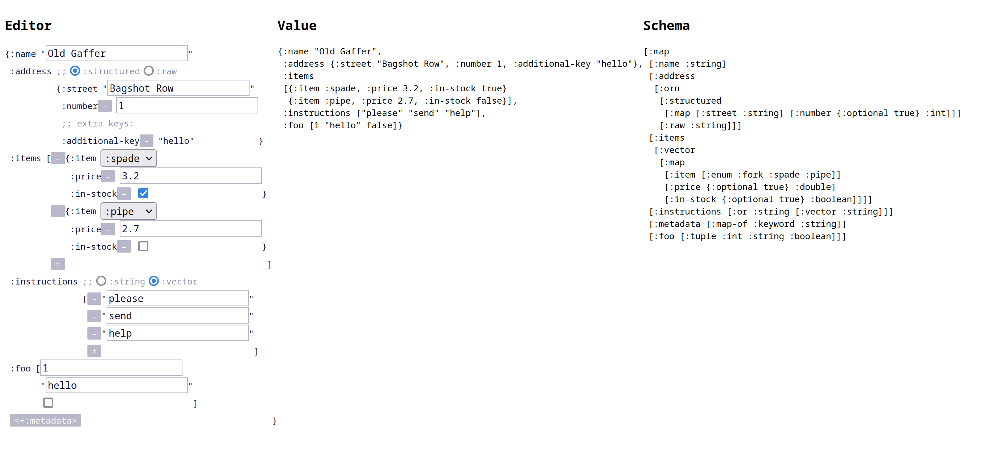

# malli-edn-editor

A web editor for Clojure data (or [EDN](https://github.com/edn-format/edn))
that has a [malli](https://github.com/metosin/malli) schema.

Probably not usable for your use case as-is, but more of a source of
inspiration for malli-driven UIs.

[Jump in and read the code!](./src/editor.cljs)

[Live demo](https://opqdonut.github.io/malli-edn-editor/)

